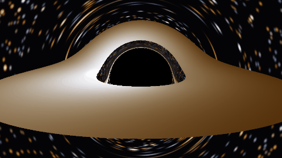
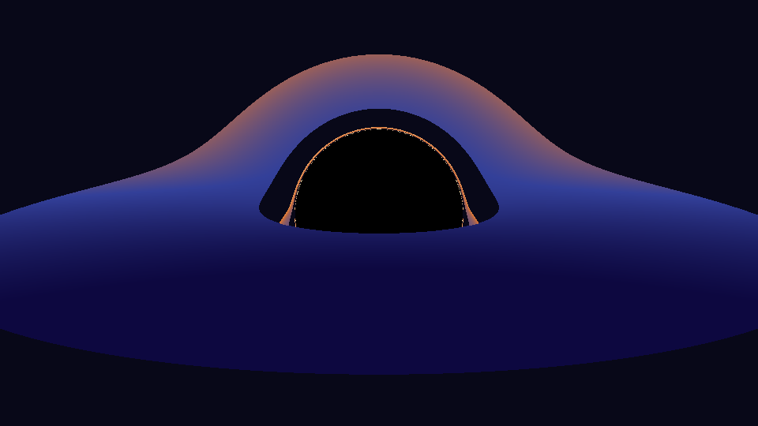

# Schwarzschild Black Hole Raytracer

A CPU-parallel raytracer in Rust that renders a Schwarzschild black hole by
numerically integrating null geodesics through curved spacetime — not a shader
trick, actual general relativity. Every pixel is a photon path traced backward
from the camera through the Schwarzschild metric with RK4, in units of the
black hole mass (G = c = M = 1).


```bash
cargo run --release            # writes render.png (the image above)
```

## What you're looking at

- **The shadow** — the black region is the set of directions whose photons
  spiral through the event horizon. Its edge sits at impact parameter
  b = 3√3 M ≈ 5.196 M, noticeably larger than the horizon itself (r = 2 M),
  because light bending lets the hole capture rays that would classically miss.
- **The warped disk** — the accretion disk lies flat in the equatorial plane
  (r = 6 M to 20 M), yet it appears wrapped over and under the shadow: light
  from the disk's far side bends around the hole to reach the camera. The thin
  bright line hugging the shadow is a *secondary* image — light that wrapped
  a full extra half-orbit.
- **Doppler beaming** — disk material orbits at half the speed of light near
  the inner edge. The approaching side is blueshifted and brightened by
  relativistic beaming (∝ g⁴), the receding side redshifted and dimmed; the
  gravitational redshift additionally dims the innermost radii.
- **Lensed stars** — the procedural starfield warps into tangential arcs
  around the critical ring. The faint sparse stars visible in the dark band
  between the shadow and the disk are the entire background sky, demagnified
  through the gap between the horizon and the disk's inner edge.

| Face-on (`--inclination 2`) | Near-edge-on (`--inclination 88`) |
|---|---|
|  |  |

The near-edge-on view reproduces the classic geometry first computed by
Luminet (1979): the far side of the disk is visible both above *and* below
the hole.

## Physics

Null geodesics of the Schwarzschild metric

```
ds² = -(1 - 2/r) dt² + (1 - 2/r)⁻¹ dr² + r² dΩ²
```

are integrated per ray in the ray's own orbital plane (every geodesic is
planar), using the equatorial-slice geodesic equations with conserved energy
E = (1 − 2/r) dt/dλ eliminating the time equation. The integrator is classic
RK4 with an adaptive step h = q(r − 2) that shrinks geometrically toward the
horizon (never overshooting the coordinate singularity) and near the photon
sphere where curvature peaks.

Camera rays are built in the local orthonormal frame of a static observer —
the √(1 − 2/r_cam) tetrad factor on the radial momentum component is what
makes the shadow come out the correct size. Disk crossings are detected as
sign changes of the global height z = r(e1·ẑ cos φ + e2·ẑ sin φ) where
(e1, e2) is the per-ray plane basis; crossings outside the disk annulus keep
integrating, which is what produces the far-side and underside images.

Disk shading: thin-disk temperature profile T ∝ r^(−3/4), combined
gravitational + Doppler shift for a circular-orbit emitter

```
g = √(1 - 3/r) / (√(1 - 2/r_cam) · (1 + Ω b_z)),   Ω = r^(-3/2)
```

using the photon's conserved z-axis angular momentum (computable at ray
setup). Observed temperature T_obs = g·T and intensity ∝ T_obs⁴ capture
beaming and color shift consistently. Blackbody colors come from integrating
the Planck spectrum against analytic CIE fits (Wyman–Sloan–Shirley 2013) —
no lookup-table data files.

## Simulation: orbiting hot spot with retarded time



The scene can be made time-dependent: a Gaussian hot spot orbits the disk at
`--spot-r` on a circular geodesic (Ω = r^(−3/2), one orbit at r = 7 takes
2π·7^1.5 ≈ 116 M of coordinate time). Coordinate time is integrated along
every ray as a 5th state component (dt/dλ = E/(1 − 2/r), validated against
the tortoise-coordinate closed form Δt = Δr + 2 ln((r₁−2)/(r₀−2)) to 10⁻⁶),
and every disk hit is shaded at the photon's **retarded** emission time

```
t_emit = t_frame − Δt_light,     φ_spot(t_emit) = Ω_spot · t_emit
```

so light-travel delays are physically correct. That is what the clip above
actually demonstrates: light from the disk's far side takes longer to reach
the camera than light from the near side, and the wrapped secondary image
(the thin ring hugging the shadow) is delayed further still — so the spot's
ring image visibly *lags* its primary image, and a light echo sweeps the
ring once per orbit. The spot multiplies the emitted *temperature*
(1 + amp·gaussian), so it is hotter and bluer, not just brighter, and its
brightness still pulses through the Doppler cycle via the same T_obs⁴
pipeline as the disk. The animation clock is coordinate time; a clock riding
with the camera at r = 30 ticks slower by the constant factor
√(1 − 2/30) ≈ 0.966.

For a fixed camera the ray geometry never changes, so `--frames N
--frame-dt DT` traces the image once and re-shades it N times — about 200×
faster per frame than re-tracing (a frame re-shades in milliseconds), and
each emitted frame is byte-identical to the equivalent single `--time T`
invocation (enforced by test):

```bash
# one spot orbit, 58 frames
cargo run --release -- --spot-amp 1.2 --frames 58 --frame-dt 2 --output frames/f.png
```

`scripts/orbit.sh` renders a camera orbit instead (`--azimuth` sweep, one
trace per frame since the geometry moves) and assembles the frames with
ffmpeg. Set `TIME_PER_FRAME` to advance the simulation clock during the
orbit — camera and spot orbit together, echoes included:

```bash
TIME_PER_FRAME=1 FRAMES=360 ./scripts/orbit.sh --spot-amp 1.2
```

### Seeing the light delays directly



`--render-mode echo` drops the physical shading and false-colors every disk
pixel by its light-travel delay Δt instead (blue = youngest light, orange →
white = oldest). The far side reads older than the near side, and the
wrapped secondary ring hugging the shadow is the oldest light in frame —
the picture *is* the retarded-time structure that the hot-spot animation
plays out in time.

`--profile nt` switches the disk temperature law from T ∝ r^(−3/4) to
Novikov–Thorne, T ∝ [r⁻³(1 − √(6/r))]^(1/4): the zero-torque inner
boundary makes the disk fade to black at the ISCO with the peak at
r = 49/6 ≈ 8.17.

## Real-time viewer

```bash
cargo run --release --features viewer --bin viewer
```

opens an interactive window (winit + softbuffer, optional dependencies
behind the `viewer` feature — the default build stays rayon + image only).
It renders through a precomputed **δ-table**: at fixed camera radius every
geodesic is a function of the single screen angle ε, so the viewer
tabulates ~4k trajectory polylines (φ, r, t) on a geometrically refined ε
grid — spacing shrinks toward the capture boundary ε_crit =
asin(b_crit·√f/r_cam), where deflection diverges — plus a subcritical set
for plunging rays that cross the near-side disk before the horizon. Per
pixel, disk crossings are then *analytic* (z = r(a cos φ + b sin φ) = 0 ⇒
φ = −atan2(a,b) + kπ) and resolve with two binary searches instead of
~500 RK4 steps; shading reuses the exact offline Scene code, so table
frames match full renders to a few counts per channel outside a thin band
at the photon ring (enforced by test — the ring itself just looks slightly
soft).

| Key | Action |
|---|---|
| ← / → | orbit azimuth |
| ↑ / ↓ | inclination |
| Z / X | zoom (never rebuilds — the table covers the full zoom range) |
| Q / E | camera radius (the one action that rebuilds the table, ~0.3 s) |
| Space | pause the simulation clock |
| , / . | scrub time ±5 M |
| H | toggle the hot spot |
| Esc | quit |

`--table` runs the same fast path headless on the main binary (PNG out),
which is also how it's verified.

## Correctness

`cargo test` runs 26 tests, including the physics sanity checks from the
project spec:

- a photon launched tangentially at the photon sphere (r = 3) stays
  near-circular over a full orbit (unstable equilibrium — long-term drift is
  physically correct);
- weak-field deflection matches the textbook 4M/b (b = 100 M, within 5%,
  dominated by the known second-order term);
- b_crit = 3√3 M separates capture from escape to 0.1%;
- conserved quantities (L, null condition) drift < 10⁻⁶ along a strongly
  bent ray;
- bisecting the capture boundary through the camera code recovers b_crit to
  10⁻³ — this catches tetrad-normalization bugs that make the shadow ~3%
  the wrong size while looking entirely plausible;
- the rendered silhouette's pixel radius matches the analytic prediction
  (W/2)·tan(asin(b_crit √(1−2/r_cam) / r_cam)) / tan(fov/2);
- the parallel render is byte-identical to the serial one;
- integrated coordinate time along a radial ray matches the
  tortoise-coordinate closed form to 10⁻⁶, and far-side disk light arrives
  later than near-side light;
- `--spot-amp 0` is byte-identical to the plain disk (no parameter leakage),
  the spot moves with frame time, and frames-mode output is byte-identical
  to equivalent single-frame invocations;
- the δ-table's analytic ε_crit matches integrator bisection to 10⁻⁶ rad,
  its capture/escape classification and disk hits (radius and retarded time
  to 0.05 M) match the full trace, and a table-shaded image agrees with the
  full render for ≥99% of pixels within 4/255 per channel outside a 3 mrad
  band at the photon ring.

## Performance

Each pixel is a pure function, parallelized over rows with rayon. At
1280×720, 1 sample/px:

| Mode | 10-core Apple Silicon | 4-core container |
|---|---|---|
| `--serial` | 6.2 s | 19.0 s |
| parallel (default) | 0.94 s | 5.3 s |
| frames mode, per re-shaded frame | — | 38 ms |
| δ-table, full re-render per frame | — | 0.17 s |

Serial and parallel PNGs hash identically. Frames mode re-shades a cached
trace (fixed camera, ~140× faster than re-tracing); the δ-table pays a
0.2 s build per camera radius and then re-renders the *whole frame* —
camera motion included — ~30× faster than a full trace, which is what makes
the interactive viewer possible on CPU.

## Usage

```
schwarzschild-raytracer [OPTIONS]
  --width N          image width in px          (default 1920)
  --height N         image height in px         (default 1080)
  --output PATH      output PNG path            (default render.png)
  --r-cam R          camera radius in M         (default 30.0)
  --inclination DEG  polar angle from +z axis   (default 80.0; 90 = in disk plane)
  --azimuth DEG      camera azimuth around +z   (default 0.0)
  --fov DEG          horizontal field of view   (default 75.0)
  --samples N        NxN supersampling          (default 2)
  --serial           render single-threaded (benchmark comparison)
  --max-steps N      per-ray integration cap    (default 60000)
  --step-scale Q     RK4 step h = Q*(r-2)       (default 0.02)
  --exposure X       disk intensity scale       (default 4.0)
  --time T           frame coordinate time in M (default 0.0)
  --spot-amp A       hot-spot amplitude, 0=off  (default 0.0)
  --spot-r R         hot-spot orbit radius in M (default 7.0)
  --frames N         frames to emit (fixed cam) (default 1)
  --frame-dt DT      time step between frames   (default 1.0)
  --profile P        disk temperature law: thin | nt (default thin)
  --render-mode M    color | echo (light-delay false color; default color)
  --table            render via the precomputed δ-table (viewer's fast path)
```

The viewer binary (`--features viewer --bin viewer`) accepts the same
flags for its initial state.

Dependencies: `rayon` and `image` only. The vector math and CLI parsing are
hand-rolled — the physics is the whole story.
