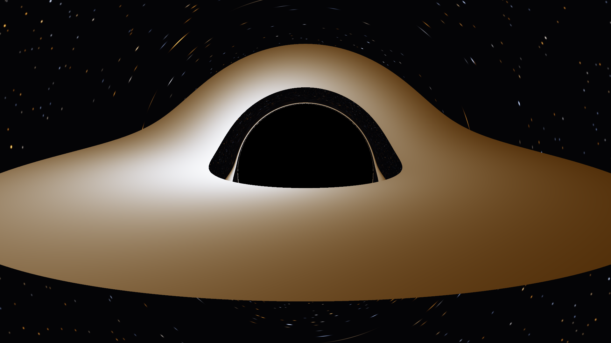
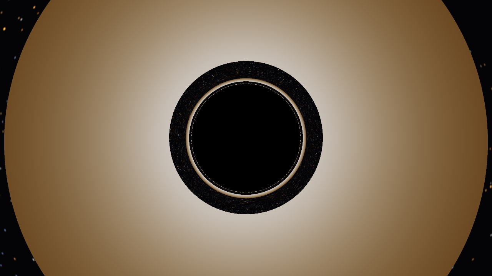
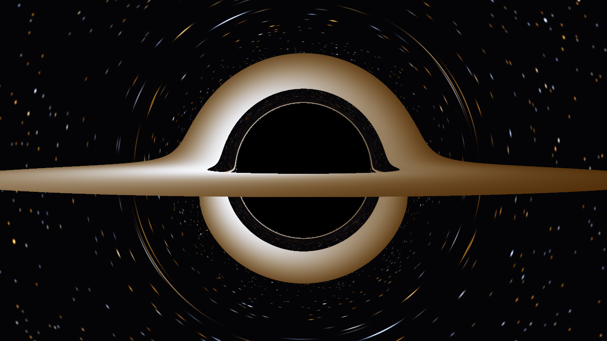

# Schwarzschild Black Hole Raytracer

A CPU-parallel raytracer in Rust that renders a Schwarzschild black hole by
numerically integrating null geodesics through curved spacetime — not a shader
trick, actual general relativity. Every pixel is a photon path traced backward
from the camera through the Schwarzschild metric with RK4, in units of the
black hole mass (G = c = M = 1).



```bash
cargo run --release            # writes render.png (the image above)
```

## What you're looking at

- **The shadow** — the black region is the set of directions whose photons
  spiral through the event horizon. Its edge sits at impact parameter
  b = 3√3 M ≈ 5.196 M, noticeably larger than the horizon itself (r = 2 M),
  because light bending lets the hole capture rays that would classically miss.
- **The warped disk** — the accretion disk lies flat in the equatorial plane
  (r = 6 M to 20 M), yet it appears wrapped over and under the shadow: light
  from the disk's far side bends around the hole to reach the camera. The thin
  bright line hugging the shadow is a *secondary* image — light that wrapped
  a full extra half-orbit.
- **Doppler beaming** — disk material orbits at half the speed of light near
  the inner edge. The approaching side is blueshifted and brightened by
  relativistic beaming (∝ g⁴), the receding side redshifted and dimmed; the
  gravitational redshift additionally dims the innermost radii.
- **Lensed stars** — the procedural starfield warps into tangential arcs
  around the critical ring. The faint sparse stars visible in the dark band
  between the shadow and the disk are the entire background sky, demagnified
  through the gap between the horizon and the disk's inner edge.

| Face-on (`--inclination 2`) | Near-edge-on (`--inclination 88`) |
|---|---|
|  |  |

The near-edge-on view reproduces the classic geometry first computed by
Luminet (1979): the far side of the disk is visible both above *and* below
the hole.

## Physics

Null geodesics of the Schwarzschild metric

```
ds² = -(1 - 2/r) dt² + (1 - 2/r)⁻¹ dr² + r² dΩ²
```

are integrated per ray in the ray's own orbital plane (every geodesic is
planar), using the equatorial-slice geodesic equations with conserved energy
E = (1 − 2/r) dt/dλ eliminating the time equation. The integrator is classic
RK4 with an adaptive step h = q(r − 2) that shrinks geometrically toward the
horizon (never overshooting the coordinate singularity) and near the photon
sphere where curvature peaks.

Camera rays are built in the local orthonormal frame of a static observer —
the √(1 − 2/r_cam) tetrad factor on the radial momentum component is what
makes the shadow come out the correct size. Disk crossings are detected as
sign changes of the global height z = r(e1·ẑ cos φ + e2·ẑ sin φ) where
(e1, e2) is the per-ray plane basis; crossings outside the disk annulus keep
integrating, which is what produces the far-side and underside images.

Disk shading: thin-disk temperature profile T ∝ r^(−3/4), combined
gravitational + Doppler shift for a circular-orbit emitter

```
g = √(1 - 3/r) / (√(1 - 2/r_cam) · (1 + Ω b_z)),   Ω = r^(-3/2)
```

using the photon's conserved z-axis angular momentum (computable at ray
setup). Observed temperature T_obs = g·T and intensity ∝ T_obs⁴ capture
beaming and color shift consistently. Blackbody colors come from integrating
the Planck spectrum against analytic CIE fits (Wyman–Sloan–Shirley 2013) —
no lookup-table data files.

## Correctness

`cargo test` runs 13 tests, including the physics sanity checks from the
project spec:

- a photon launched tangentially at the photon sphere (r = 3) stays
  near-circular over a full orbit (unstable equilibrium — long-term drift is
  physically correct);
- weak-field deflection matches the textbook 4M/b (b = 100 M, within 5%,
  dominated by the known second-order term);
- b_crit = 3√3 M separates capture from escape to 0.1%;
- conserved quantities (L, null condition) drift < 10⁻⁶ along a strongly
  bent ray;
- bisecting the capture boundary through the camera code recovers b_crit to
  10⁻³ — this catches tetrad-normalization bugs that make the shadow ~3%
  the wrong size while looking entirely plausible;
- the rendered silhouette's pixel radius matches the analytic prediction
  (W/2)·tan(asin(b_crit √(1−2/r_cam) / r_cam)) / tan(fov/2);
- the parallel render is byte-identical to the serial one.

## Performance

Each pixel is a pure function, parallelized over rows with rayon. At
1280×720, 1 sample/px on a 10-core Apple Silicon machine:

| Mode | Time | Throughput |
|---|---|---|
| `--serial` | 6.2 s | 0.15 Mrays/s |
| parallel (default) | 0.94 s | 0.98 Mrays/s |

6.6× speedup; output PNGs hash identically.

## Usage

```
schwarzschild-raytracer [OPTIONS]
  --width N          image width in px          (default 1920)
  --height N         image height in px         (default 1080)
  --output PATH      output PNG path            (default render.png)
  --r-cam R          camera radius in M         (default 30.0)
  --inclination DEG  polar angle from +z axis   (default 80.0; 90 = in disk plane)
  --fov DEG          horizontal field of view   (default 75.0)
  --samples N        NxN supersampling          (default 2)
  --serial           render single-threaded (benchmark comparison)
  --max-steps N      per-ray integration cap    (default 60000)
  --step-scale Q     RK4 step h = Q*(r-2)       (default 0.02)
  --exposure X       disk intensity scale       (default 4.0)
```

Dependencies: `rayon` and `image` only. The vector math and CLI parsing are
hand-rolled — the physics is the whole story.
